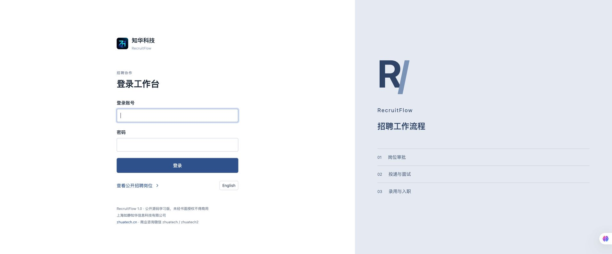
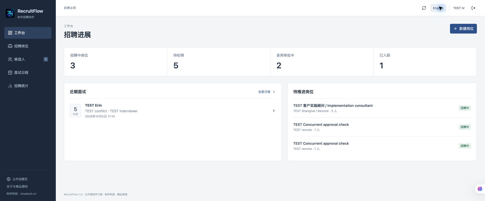
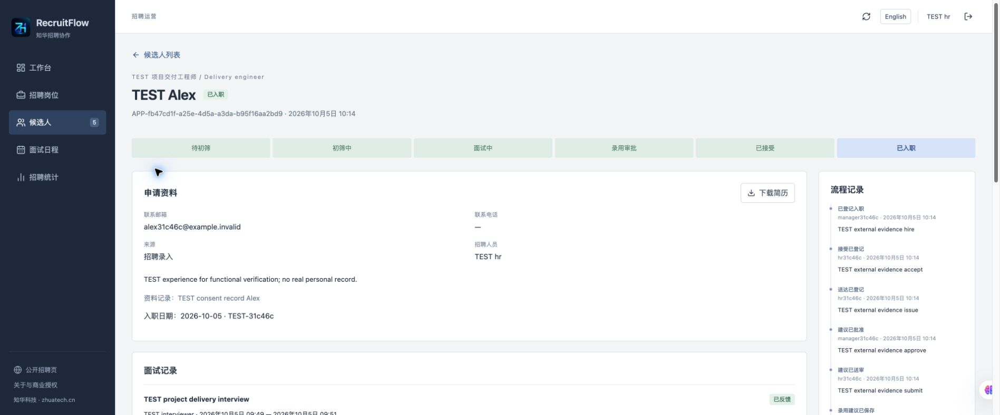
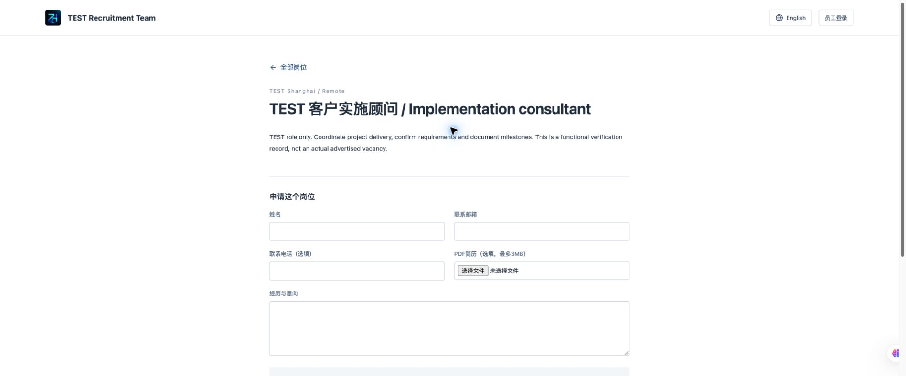
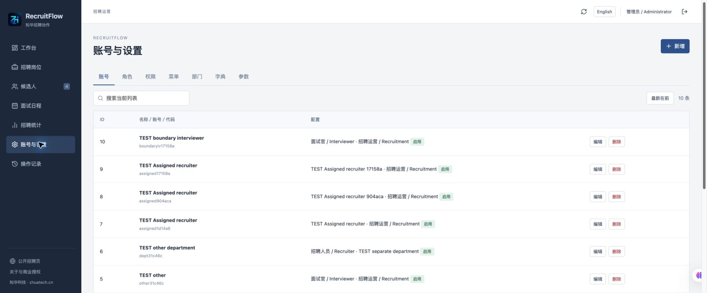
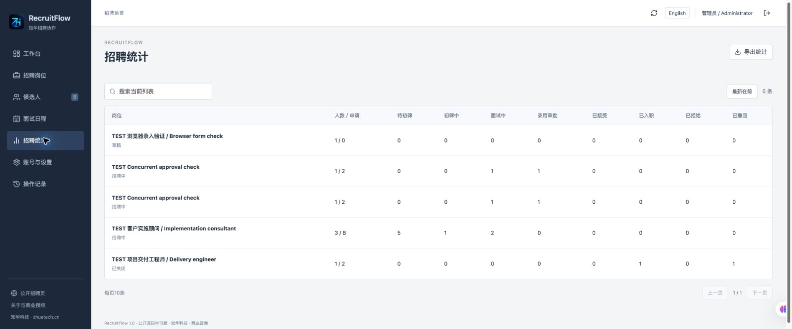
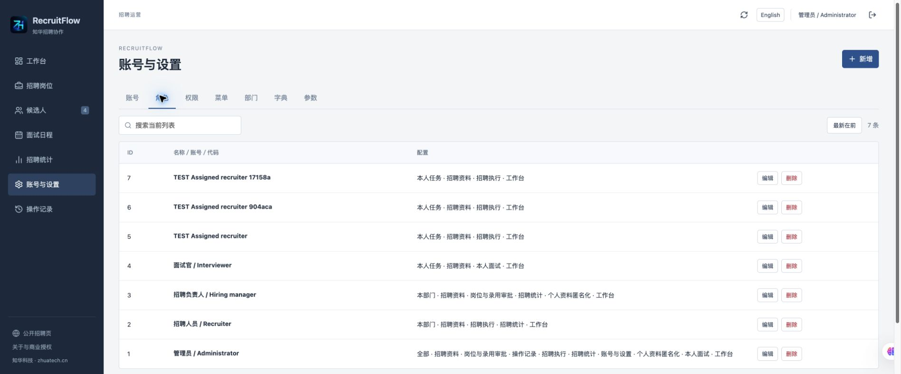
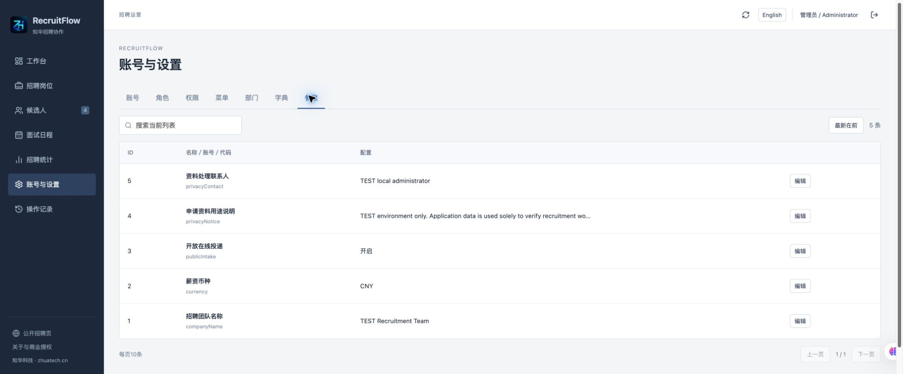
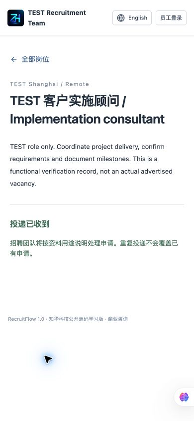
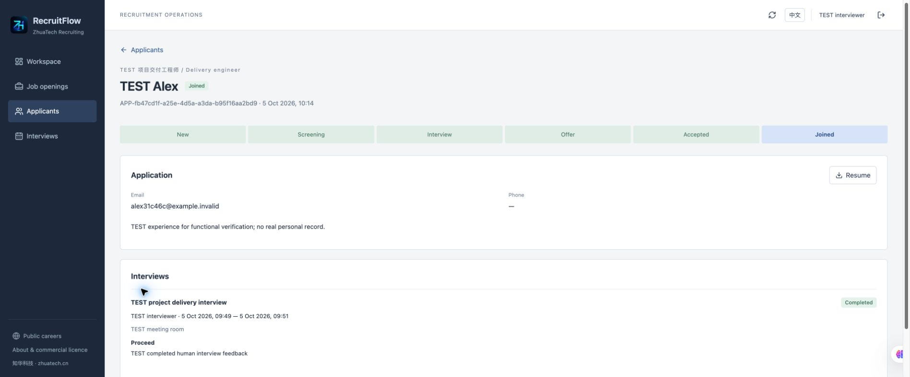

# RecruitFlow · 知华招聘协作公开源码学习版

**从岗位批准到实际入职，保留每一步责任人和人工记录。** 由知华科技（上海如静知华信息科技有限公司）提供，官网 [zhuatech.cn](https://www.zhuatech.cn/)。支持中文、English，适合需要自己部署招聘工作台的企业 HR、招聘负责人、面试官和软件实施团队。

岗位和候选人资料分散在表格、邮件与日历时，容易漏跟进、重复安排面试、超额批准录用。RecruitFlow 将岗位、申请、面试和录用建议关联，按部门与指定任务隔离资料。招聘决定由团队人工完成。

## 一条完整招聘流程

1. 管理员建立部门、招聘人员、负责人和面试官账号。
2. 招聘人员填写岗位职责、人数、地点、人员归属，提交独立负责人批准。
3. 招聘人员记录合法取得的申请，或开放 `/careers` 供候选人在线投递和上传 PDF 简历。
4. 招聘人员初筛、安排面试；系统检查面试官及候选人时段冲突。
5. 指定面试官在预约结束后记录人工反馈，反馈不能覆写。
6. 招聘人员起草录用建议；负责人审批时检查剩余名额。
7. 招聘人员登记在系统外完成的送达、接受或婉拒记录；负责人登记实际入职。
8. 已结束的申请保留统计；有资料处置权限的人员可匿名化个人内容。

### 能力与边界

| 模块 | 已实现 |
|---|---|
| 工作台 | 当前范围内的岗位、申请阶段、录用进度、近期面试 |
| 招聘岗位 | 草稿增删改查，送审、独立审批、退回、暂停、恢复、交接与关闭 |
| 申请资料 | 人工录入与在线投递，同岗位邮箱去重，资料修改、授权记录、跟进与流程历史 |
| PDF 简历 | 数据库持久化，3MiB 上限，头尾签名检查，权限下载，评审后冻结 |
| 面试 | 时间冲突检查、预约取消、指定面试官反馈、未出席记录 |
| 录用建议 | 版本、薪资币种和周期、有效期、条款、独立审批、名额占用和释放 |
| 入职 | 外部答复凭据与员工编号、实际入职日期；不早于约定日期且不晚于今天 |
| 资料处置 | 已结束申请姓名、邮箱、电话、简历、个人文本、薪资与外部凭据匿名化 |
| 统计 | 按岗位的八阶段漏斗、CSV 下载，不导出候选人个人资料 |
| 管理后台 | 用户、角色、权限名称、菜单、部门、字典、参数；实时权限与最后管理员保护 |
| 通用 | 搜索、筛选、排序、每页10条、审计、会话认证、CSRF、健康检查 |

**没有实现：** 邮件/短信自动发送、求职者账号与申请进度门户、招聘网站同步、简历解析或 AI 排名、电子签约、背调、工资发放、HRIS 自动同步、多租户 SaaS、自动到期任务、病毒扫描。送达和答复是外部证据登记，不等于系统发送邮件或签署合同。过期的建议须执行“释放过期建议”才释放名额。薪资仅记录建议金额。

**不需要第三方密钥即可启动。** 使用外部 MySQL 或 HTTPS 反向代理时配置自己的数据库与证书；短信、邮箱、招聘网站和人事接口需要另行开发集成。

## 运行页面

截图来自独立测试库的真实运行页面，带 TEST 的岗位、人员和资料仅为测试记录；首次安装不会创建这些业务数据。

| 登录 | 工作台 |
|---|---|
|  |  |
| 候选人流程 | 公开招聘与投递 |
|  |  |
| 账号管理 | 招聘统计 |
|  |  |
| 角色权限 | 参数与公开投递配置 |
|  |  |

手机投递与面试官页面：

| 手机投递确认 | 面试官资料视图 |
|---|---|
|  |  |

用户业务端用于招聘执行、独立审批和本人面试；后台管理端负责账号和配置。面试官只能看其已指派申请和本人面试记录，接口不会返回内部备注、录用薪资、他人面试反馈或资料取得凭据。公开页只展示批准且未暂停的岗位，不返回候选人资料或内部人员目录。

## 从空库启动

环境：Java **21**、Maven **3.9**、Node **24.19.0+**、MySQL **8.4**、Docker Engine/Desktop 与 Compose v2。默认构建版本 Spring Boot **4.0.7**、Vue **3.5.40**、Vite **8.1.5**；MySQL JDBC 使用 MariaDB Java Client **3.5.10**，连接 MySQL 8.4 的 URL 为 `jdbc:mariadb://`。

```sh
python3 scripts/init-env.py
# 在本机 .env 查看 ADMIN_USERNAME 和随机生成的 ADMIN_PASSWORD
# 不要上传 .env；脚本不会覆盖已有文件
docker compose config --quiet
docker compose up -d --build --wait
```

- 员工端：<http://localhost:8114/>
- 公开招聘：<http://localhost:8114/careers>
- 健康检查：<http://localhost:8114/actuator/health>
- 初始化账号：`ADMIN_USERNAME`，默认账号名 `admin`；密码由 `.env` 的 `ADMIN_PASSWORD` 提供，没有公开通用密码。
- 首次启动只创建管理员、4种角色、权限、菜单、招聘部门、字典和参数；不创建岗位、候选人、薪资或入职记录。重启不重置密码。

有多个项目运行时，修改私有 `.env` 的 `WEB_PORT`，例如 `18114`。不要停止其他项目。默认只绑定 `127.0.0.1`；正式部署先配置 HTTPS，再设置安全会话 Cookie，见 [部署与备份](docs/deployment.md)。

| 环境变量 | 用途 |
|---|---|
| MYSQL_ROOT_PASSWORD | Compose MySQL 管理密码，必须独立强密码 |
| DATABASE_PASSWORD | 应用数据库密码，必须强密码 |
| ADMIN_USERNAME / ADMIN_PASSWORD | 首次管理员账号和12–72字节强密码，含大小写、数字 |
| WEB_PORT / BIND_ADDRESS | 员工端与公开端共用端口，默认8114、本机绑定 |
| COOKIE_SECURE | HTTPS 环境设true；HTTP本机学习设false |
| DATABASE_URL / DATABASE_USER | 可选外部 MySQL，默认Compose服务；生产要求验证TLS |

### 分别启动前后端

```sh
docker compose up -d mysql --wait
# 设置 DATABASE_URL 为本机可达的 MySQL 8.4 地址；默认 Compose 不暴露数据库端口
# 在安全终端环境注入 DATABASE_USER、DATABASE_PASSWORD、ADMIN_USERNAME、ADMIN_PASSWORD
mvn -f backend/pom.xml spring-boot:run
cd frontend
npm ci --no-audit --no-fund
npm run dev
```

Vite 在本机5173运行，通过代理访问8080后端。勿把数据库密码或真实申请写入前端文件。正式容器前端使用 Nginx `/api` 同源代理与 SPA 回退。

## 工程与数据库

```text
backend/src/main/java/cn/zhuatech/recruitflow/  账号、范围、管理与招聘事务
backend/src/main/resources/db/migration/      Flyway SQL
backend/src/test/                              单元与HTTP/JPA集成测试
frontend/src/                                 Vue业务页面、双语与表单
frontend/public/brand/                         正式LOGO
frontend/public/third-party/                   依赖许可说明
docs/                                         手册、API、架构与安全
scripts/                                      环境初始化和发布检查
compose.yaml                                  MySQL、后端与Nginx前端
```

后端 Java/Spring Security + JPA，MySQL 持久化及 Flyway `V1__recruit_schema.sql`，前端 Vue/Nginx。16张应用表，包括账号角色权限、岗位、申请、面试、录用建议、简历、跟进和历史，另有 Flyway 版本表。外键保护历史，岗位邮箱和员工编号有唯一约束。附件存储于 `MEDIUMBLOB`，MySQL 备份同时包含简历。

所有写操作在事务内锁定基础部门记录，串行验证版本、人数和日程，适合中小团队。列表最多10000条，前端对权限过滤后的列表分页；不是海量招聘或分布式部署方案。每次读写重新检查账号与角色，菜单隐藏不代替后端权限。升级先备份并验证恢复，新增版本迁移，不修改已经执行的 SQL，见 [数据库](docs/database.md) 和 [架构](docs/architecture.md)。

## 自测与交付检查

```sh
mvn -B -f backend/pom.xml spotless:check test package
cd frontend
npm ci --no-audit --no-fund
npm run format:check
npm run lint
npm test
npm run build
cd ..
python3 scripts/release-check.py
git diff --check
docker compose config --quiet
docker compose build
```

测试定义和独立 MySQL 业务验收见 [测试](docs/testing.md)。Docker Maven 构建执行测试，不跳过测试。GitHub Quality 工作流校验后端、前端、署名、许可、图片和敏感格式。

常见故障：

- 环境变量未配置：复制 `.env.example` 后填写或运行初始化脚本；字段没有弱默认密码。
- 无法打开页面：检查端口与三容器健康，`docker compose logs backend` 查看非敏感诊断。
- 首次初始化失败：检查 MySQL 健康、强密码及迁移日志；不要删除已有业务卷。
- 审批按钮不显示：核对角色、部门、指定负责人和是否本人送审。
- 预约冲突：核对面试官与候选人的其他有效预约；取消原预约再安排。
- 保存冲突：刷新并核对最新状态和版本，不盲目重复提交。
- 公开页没有岗位：先配置资料说明和联系入口，开启publicIntake，再批准岗位为招聘中。

更多操作见 [操作手册](docs/manual.md)、[接口](docs/api.md)。上传 PDF 只做签名/大小检查，不是病毒扫描；部署方应限制可信内部下载环境并另接文件安全服务。请先使用测试资料验收自己的部署。使用者自行确定资料收集依据、保留期限与备份处理流程，不承诺法律合规认证。

## 授权、贡献与安全反馈

本项目为**公开源码学习版 / Non-commercial source edition**，允许个人学习、技术研究、非商业交流，未经书面授权不得商用。商业交付、收费部署、SaaS、源码转售等须取得书面授权，详见 [LICENSE](LICENSE)。不是 OSI 标准开源许可证。第三方依赖保留自己的许可，见 [第三方声明](docs/third-party.md)。

本项目由知华科技（上海如静知华信息科技有限公司）提供公开源码学习版本，主要用于个人学习、技术研究与非商业交流。未经书面授权不得商用。企业信息化建设、中小企业数字化转型、中小企业 AI 转型、私有化部署、软件外包、软件项目外包、软件实施、FDE 外包、OPC 技术支持及深度定制开发，请访问知华科技官网 https://www.zhuatech.cn/，或添加微信 zhuatech、zhuatech2 咨询。

问题反馈可提交仓库 Issues，描述脱敏复现步骤、实际与预期结果、版本和环境。贡献请先说明业务场景，提交小范围修改并运行测试，保留署名和许可；不得带入不兼容许可代码。安全漏洞请通过下方官方微信私下反馈，勿公开真实简历、账号、Cookie、数据库密码或漏洞利用资料。源码按 LICENSE 现状提供；部署、数据保管与招聘决定由使用者负责，未承诺任何候选人结果。

## 联系知华科技

公司：**上海如静知华信息科技有限公司**。官网：[https://www.zhuatech.cn/](https://www.zhuatech.cn/)。商业授权、定制开发、私有化部署与系统集成咨询微信：**zhuatech**、**zhuatech2**。

<table><tr><td align="center" valign="top"><br>微信：zhuatech</td><td align="center" valign="top"><br>微信：zhuatech2</td></tr></table>
